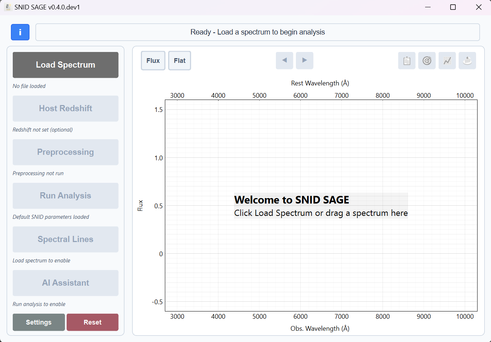
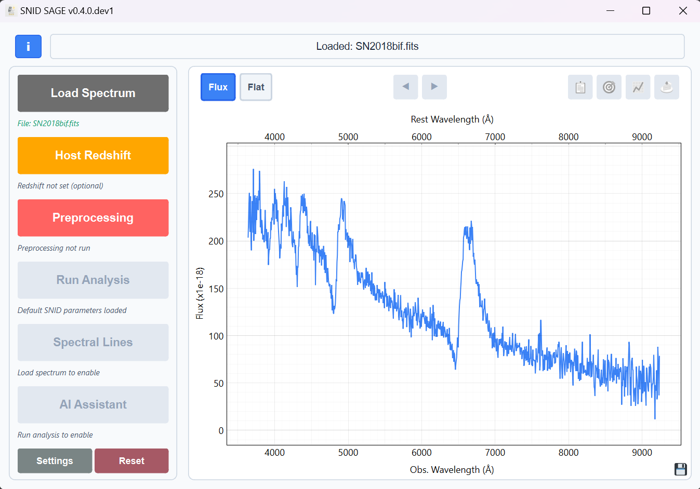
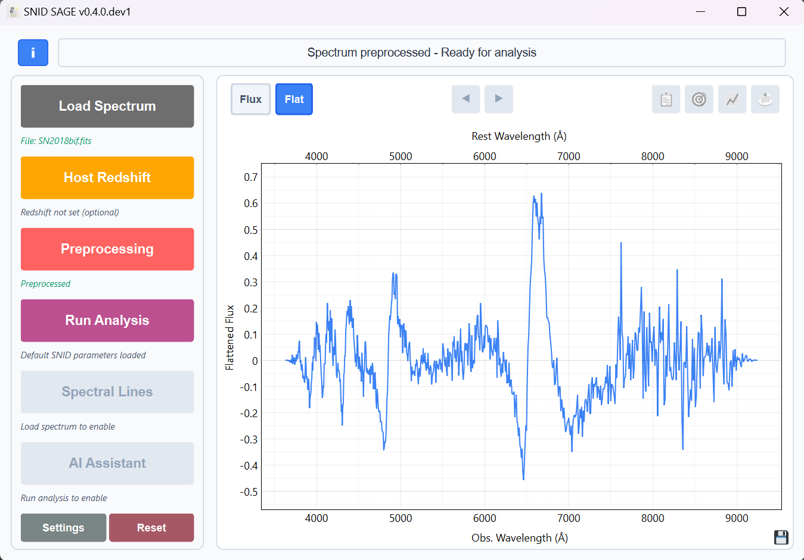
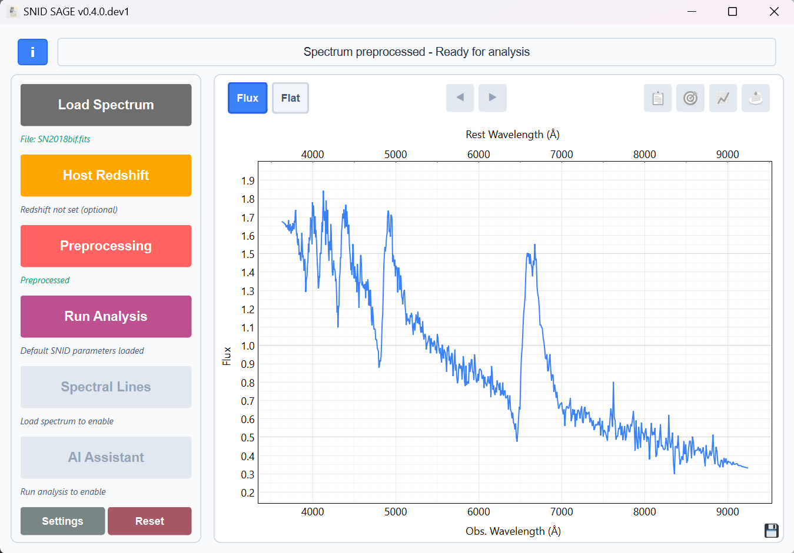
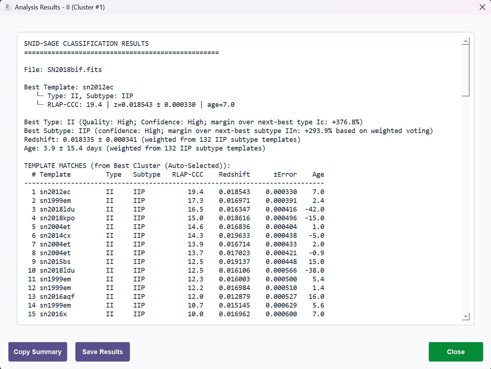
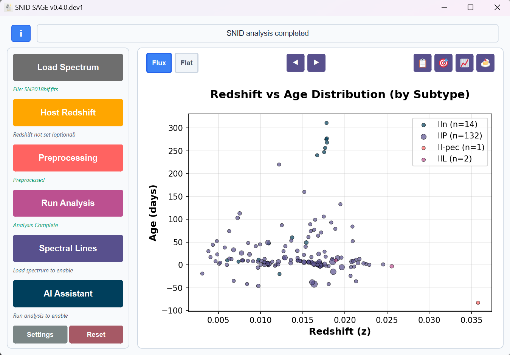

# Your First Analysis with SNID SAGE

Welcome to SNID SAGE! This guide will walk you through your first supernova spectrum analysis in just 5 minutes using the GUI interface.

## What You'll Learn

- How to load and analyze a spectrum
- Choosing the best cluster when multiple options exist
- Understanding basic results
- Simple visualization
- Next steps for deeper exploration

## Get Sample Data

You'll need a supernova spectrum to follow along. We recommend SN 2018bfi:

1. **Download**: [SN2018bif spectrum from WISeREP](https://www.wiserep.org/system/files/uploaded/PESSTO_SSDR1-4/SN2018bif_2018-05-12_03-09-55_ESO-NTT_EFOSC2-NTT_PESSTO_SSDR1-4.csv)
2. **Save**: Create a `data/` folder and save the file there as `SN2018bif.csv`
3. **Note**: This is a CSV format spectrum from the PESSTO survey

## Step-by-Step Analysis

### Step 1: Launch SNID SAGE
```bash
snid-sage
```



The main window opens with a clean interface ready for analysis. The toolbar at the top provides quick access to essential functions.

### Step 2: Load Your Spectrum
1. Click the **"Load Spectrum"** button (grey button at top)
2. Navigate to your `data/` folder
3. Select `SN2018bif.csv`
4. **Alternative**: You can also drag and drop the spectrum file directly onto the plot area
5. The spectrum appears in the plot area



Once loaded, your spectrum appears in the main plot area. The interface shows:
- **Raw spectrum** in the main plot
- **File information** in the status bar
- **Available actions** become enabled

### Step 3: Preprocess Your Data
1. Click **"Preprocessing"** button (amber - now enabled)
2. **Right-click** for **"Quick SNID Preprocessing"** (automatic)
3. **Left-click** for **"Advanced Manual Preprocessing"** (custom settings)
4. Review the cleaned spectrum



The flattened view shows the continuum-removed spectrum, making absorption and emission features more prominent. This is the direct output of preprocessing.



The preprocessing dialog shows your spectrum with preprocessing options:
- **Filtering**: Remove noise and artifacts
- **Rebinning**: Adjust spectral resolution
- **Continuum removal**: Normalize the spectrum
- **Apodization**: Smooth spectral edges

You can switch to the flux view by clicking the **Flux** button in the top-left corner.

### Step 4: Run Analysis
1. Click **"SNID Analysis"** button (magenta - now enabled)
2. **Right-click** for **default quick analysis**
3. **Left-click** for **specific analysis settings**
4. Wait 10-30 seconds for analysis to complete


The analysis dialog shows:
- **Progress bar**: Current analysis stage
- **Status messages**: What's happening
- **Cancel button**: Stop analysis if needed

5. Results appear automatically

### Step 5: Choose Your Cluster (If Available)
If SNID SAGE finds multiple viable clusters, a **Cluster Selection Dialog** will appear:


What you'll see:
- **3D Interactive Plot**: Shows all clusters in redshift vs type vs correlation space
- **Cluster Dropdown**: Click "▼ Select Cluster" in top-left to see all options
- **Top Matches Panel**: Right side shows spectrum overlays for the selected cluster
- **Automatic Selection**: Best cluster is pre-selected (marked with BEST)

How to choose:
- **Hover** over clusters to highlight them
- **Click** on any cluster to select it
- **Use dropdown** to see all clusters with their types and redshifts
- **Review matches** in the right panel to see template quality
- **Click "Confirm Selection"** when satisfied

Tips:
- **Best cluster is usually correct** - the automatic selection is reliable
- **Check the matches panel** - better template overlays indicate better classification
- **Close dialog** to use automatic selection if unsure
- **Multiple clusters** often indicate ambiguous cases (e.g., II vs TDE)

## Understanding Your Results

The analysis provides a clear classification:


This view shows your spectrum overlaid with the best-matching template:
- **Your spectrum** (blue line)
- **Best template** (red line)
- **Match quality** indicators
- **Redshift information**



The summary provides:
- **Top matches** with scores
- **Spectral classification**
- **Redshift estimates**
- **Confidence levels**

Final classification:
- **Type**: Main supernova type (e.g., II, Ia, Ib, Ic)
- **Quality**: High/Medium/Low confidence level
- **Subtype**: Detailed classification (e.g., IIn, IIP, norm)

Measurements:
- **Redshift**: Determined redshift with uncertainty
- **Age**: Days from maximum light with uncertainty

Template matches:
A ranked list of best matching templates showing:
- Template name and type
- RLAP-Cos score (correlation quality)
- Individual redshift and age estimates



This plot shows:
- **Redshift distribution** across templates
- **Age estimates** for different redshifts
- **Confidence regions**
- **Best-fit parameters**


The subtype analysis reveals:
- **Detailed classifications**
- **Subtype proportions**
- **Template contributions**
- **Classification confidence**

## Basic Visualization

- **Zoom**: Mouse wheel or box selection
- **Pan**: Click and drag
- **Reset View**: Double-click
- **Toggle Views**: Switch between flux and flattened views

## Quick Tips

- **Keyboard Shortcuts**: 
  - `Ctrl+O` - Load spectrum
  - `Ctrl+Enter` - Quick preprocessing + analysis
- **Button Colors**: Grey → Amber → Magenta → Purple (workflow progression)
- **Status Bar**: Check for progress updates and messages

## CLI Analysis (Alternative Method)

You can also analyze the same spectrum using the command line interface, which provides the same functionality as the GUI with default settings.

### Basic CLI Command
```bash
# Analyze the same spectrum using CLI
sage data/SN2018bif.csv --output-dir results/
```

### What This Does
The CLI command performs the **exact same steps** as the GUI:
1. **Automatic preprocessing** - Same default settings as GUI
2. **Template matching** - Uses all available templates
3. **GMM clustering** - Automatic cluster selection (no user dialog)
4. **Results generation** - Same output format as GUI

### CLI Output
The command produces the same comprehensive results:

Final classification:
- **Type**: Main supernova type (e.g., II, Ia, Ib, Ic)
- **Quality**: High/Medium/Low confidence level
- **Subtype**: Detailed classification (e.g., IIn, IIP, norm)

Measurements:
- **Redshift**: Determined redshift with uncertainty
- **Age**: Days from maximum light with uncertainty

Template matches:
- Ranked list of best matching templates
- RLAP-Cos scores and individual estimates

### CLI Options

**Processing Modes:**
```bash
# Minimal mode - main result file only
sage data/SN2018bif.csv --output-dir results/ --minimal

# Complete mode - all outputs + plots
sage data/SN2018bif.csv --output-dir results/ --complete

# Default mode - balanced outputs 
sage data/SN2018bif.csv --output-dir results/
```

**Preprocessing Options:**
```bash
# With smoothing
sage data/SN2018bif.csv --output-dir results/ --savgol-window 11 --savgol-order 3

# Remove telluric features
sage data/SN2018bif.csv --output-dir results/ --aband-remove --skyclip
```

**Analysis Options:**
```bash
# Custom redshift range
sage data/SN2018bif.csv --output-dir results/ --zmin 0.0 --zmax 0.1

# Force specific redshift
sage data/SN2018bif.csv --output-dir results/ --forced-redshift 0.02435

# Filter by type
sage data/SN2018bif.csv --output-dir results/ --type-filter Ia II
```

### Key Differences from GUI

| Feature | GUI | CLI |
|---------|-----|-----|
| **Cluster Selection** | Interactive dialog | Automatic selection |
| **Progress Display** | Real-time progress bar | Progress bar + status |
| **Visualization** | Interactive plots | Saved plot files |
| **User Control** | Step-by-step workflow | Single command |
| **Output** | Display + files | Files only |

### CLI Advantages
- **Automation** - Perfect for scripts and batch processing
- **Consistency** - Same results every time
- **Speed** - No interactive delays
- **Server-friendly** - No GUI required
- **Auto-discovery** - Automatically finds templates directory

## Next Steps

Now that you've completed your first analysis, explore:

- **[GUI Complete Guide](../gui/interface-overview.md)** - All interface features
- **[CLI Reference](../cli/command-reference.md)** - Command-line interface
- **[AI Features](../ai/overview.md)** - AI-powered analysis

## Need Help?

- **Buttons disabled?** Follow the workflow: Load → Preprocess → Analyze
- **Poor results?** Check signal-to-noise and wavelength coverage
- **More help**: See [Troubleshooting](../reference/troubleshooting.md)

## Congratulations!

You've successfully completed your first SNID SAGE analysis! You can now:
- Load and analyze supernova spectra
- Interpret basic classification results
- Use the GUI interface effectively
- Generate basic visualizations

Ready for more? Check out our [GUI Complete Guide](../gui/interface-overview.md) for advanced features and techniques.