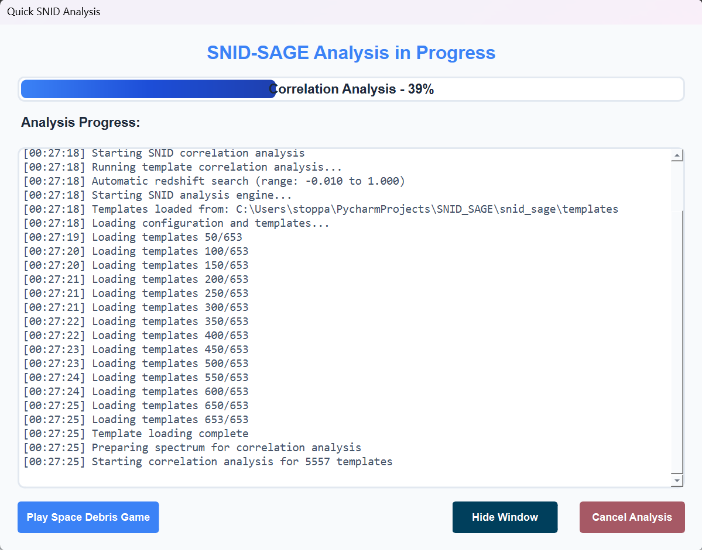

# Basic Analysis Tutorial

This tutorial walks you through your first complete analysis using SNID SAGE, from opening the GUI to interpreting results. Follow along step-by-step to learn the essential workflow.

## Prerequisites

- SNID SAGE installed (see [Installation Guide](../installation/installation.md))
- A spectrum file to analyze (FITS, ASCII, or other supported formats)

## Step 1: Launching the GUI

Start SNID SAGE by running one of these commands in your terminal:

```bash
# Launch the main GUI
snid-sage

# Or use the Python module
python -m snid_sage
```


The main window opens with a clean interface ready for analysis. The toolbar at the top provides quick access to essential functions.

## Step 2: Loading Your Spectrum

### Method 1: Drag and Drop
Simply drag your spectrum file from your file explorer directly onto the main window.

### Method 2: File Menu
1. Click **File** → **Load Spectrum**
2. Navigate to your spectrum file
3. Select the file and click **Open**

### Method 3: Toolbar Button
Click the folder icon in the toolbar to open the file dialog.


Once loaded, your spectrum appears in the main plot area. The interface shows:
- **Raw spectrum** in the main plot
- **File information** in the status bar
- **Available actions** become enabled

## Step 3: Quick Preprocessing

Before analysis, you'll want to preprocess your spectrum to improve results.

### Opening Preprocessing
- Click **Preprocessing** in the menu bar, or
- Use the toolbar preprocessing button, or
- **Right-click** on the plot and select **Quick Preprocessing**

### Preprocessing Options

#### Flux View


The flux view shows your spectrum with preprocessing options:
- **Filtering**: Remove noise and artifacts
- **Rebinning**: Adjust spectral resolution
- **Continuum removal**: Normalize the spectrum
- **Apodization**: Smooth spectral edges

#### Flattened View


The flattened view shows the continuum-removed spectrum, making absorption and emission features more prominent.

### Quick Preprocessing Shortcuts
- **Ctrl+Enter** (Windows/Linux) or **Cmd+Enter** (macOS): Apply current preprocessing settings
- **Shift+Click**: Apply preprocessing and immediately start analysis
- **Right-click** on preprocessing controls: Access advanced options

## Step 4: Starting Analysis

### Method 1: Quick Analysis
- Click **Analysis** → **Quick Analysis**, or
- Use the toolbar analysis button, or
- **Right-click** on the plot and select **Quick Analysis**

### Method 2: Full Analysis
- Click **Analysis** → **Full Analysis** for more control over parameters

### Analysis Progress



The analysis dialog shows:
- **Progress bar**: Current analysis stage
- **Status messages**: What's happening
- **Cancel button**: Stop analysis if needed

## Step 5: Clustering Results

After analysis completes, SNID SAGE groups similar templates into clusters.


The clustering view displays:
- **Template matches** grouped by similarity
- **Match scores** for each template
- **Spectral types** and subtypes
- **Redshift estimates**

### Clustering Interactions
- **Click** on a cluster to expand/collapse
- **Right-click** on templates for detailed information
- **Double-click** to view template comparison

## Step 6: Template Matching

### Flux Comparison


This view shows your spectrum overlaid with the best-matching template:
- **Your spectrum** (blue line)
- **Best template** (red line)
- **Match quality** indicators
- **Redshift information**

### Match Summary


The summary provides:
- **Top matches** with scores
- **Spectral classification**
- **Redshift estimates**
- **Confidence levels**

## Step 7: Redshift and Age Analysis

### Redshift vs Age Plot


This plot shows:
- **Redshift distribution** across templates
- **Age estimates** for different redshifts
- **Confidence regions**
- **Best-fit parameters**

### Subtype Analysis


The subtype analysis reveals:
- **Detailed classifications**
- **Subtype proportions**
- **Template contributions**
- **Classification confidence**

## Essential Keyboard Shortcuts

### Quick Workflow Shortcuts
- **Ctrl+O** (Windows/Linux) / **Cmd+O** (macOS): Open spectrum file
- **Ctrl+Enter** / **Cmd+Enter**: Quick workflow (preprocessing + analysis)
- **Ctrl+Shift+Enter** / **Cmd+Shift+Enter**: Extended quick workflow (preprocessing + analysis + auto cluster)
- **Ctrl+Shift+R** / **Cmd+Shift+R**: Reset application

### Analysis and Configuration
- **F5**: Run analysis
- **F6**: Open preprocessing dialog
- **Ctrl+R** / **Cmd+R**: Run analysis
- **Ctrl+Shift+O** / **Cmd+Shift+O**: Open SNID configuration
- **Ctrl+,** / **Cmd+,**: Open application settings

### View Controls
- **F**: Switch to flux view
- **T**: Switch to flat view
- **Spacebar**: Toggle view mode

### Template Navigation
- **← (Left Arrow)**: Previous template
- **→ (Right Arrow)**: Next template

### Help and Application
- **F1**: Show keyboard shortcuts help
- **Ctrl+/** / **Cmd+/**: Alternative shortcuts help
- **Ctrl+Q** / **Cmd+Q**: Quit application
- **Ctrl+G** / **Cmd+G**: Start games

### Right-Click Context Menus
- **Right-click on preprocessing button**: Quick preprocessing
- **Right-click on analysis button**: Quick analysis
- **Right-click on plot save button**: Export options (high-res image, SVG)

## Interpreting Your Results

### Match Quality Assessment
Based on the penalized top-5 mean score:
- **Score ≥ 10.0**: High quality - Excellent match quality
- **Score ≥ 5.0**: Medium quality - Good match quality  
- **Score < 5.0**: Low quality - Poor match quality

### Match Confidence Levels
- **High confidence**: RLAP > 10 and LAP > 5
- **Moderate confidence**: RLAP > 5 and LAP > 3
- **Low confidence**: RLAP > 2
- **Very low confidence**: RLAP ≤ 2

### Redshift Consistency
- **High confidence**: Multiple templates agree on redshift with low error
- **Medium confidence**: Some disagreement between templates
- **Low confidence**: Wide range of redshift estimates

### Spectral Classification
- **Primary type**: Most likely classification from template matches
- **Subtypes**: Detailed classification within the primary type
- **Type confidence**: Based on cluster quality and template agreement

## Next Steps

1. **Export plots**: Use the save button on plots to export as high-resolution images or SVG
2. **Try different preprocessing**: Experiment with different preprocessing settings
3. **Compare multiple spectra**: Load additional files for comparison
4. **Advanced analysis**: Explore the full analysis options for more control
5. **Configure SNID parameters**: Use Ctrl+Shift+O to adjust analysis settings

## Troubleshooting

### Common Issues
- **No templates found**: Check that template libraries are installed
- **Poor matches**: Try different preprocessing settings
- **Slow analysis**: Reduce the number of templates or use quick analysis
- **GUI not responding**: Wait for analysis to complete or restart the application

### Getting Help
- **Documentation**: Check the [Reference Guide](../reference/api-reference.md)
- **Configuration**: See [Configuration Guide](../reference/configuration-guide.md)
- **Troubleshooting**: Visit [Troubleshooting Guide](../reference/troubleshooting.md)

## Related Tutorials

- [Advanced Analysis](advanced-analysis.md): Learn advanced techniques and customization
- [AI-Assisted Analysis](ai-assisted-analysis.md): Use AI to enhance your analysis
- [Template Management](template-management.md): Manage and customize template libraries
- [Plotting and Visualization](plotting-visualization.md): Create publication-ready plots